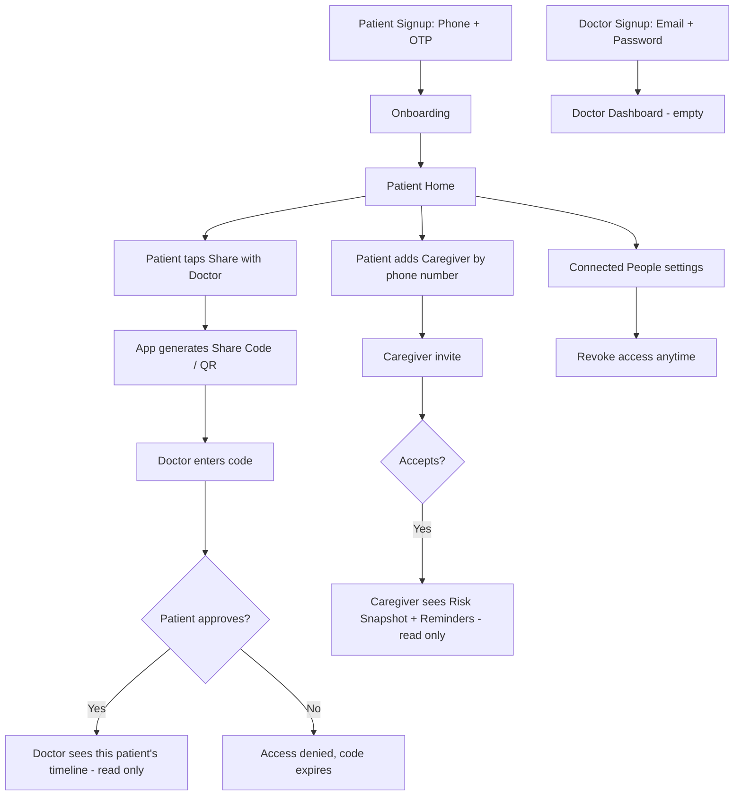
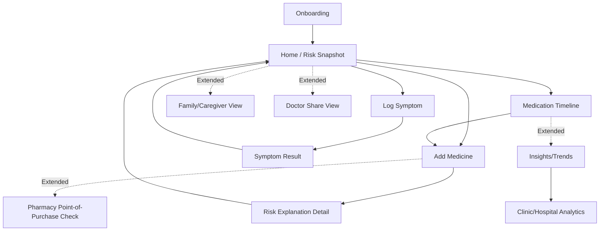
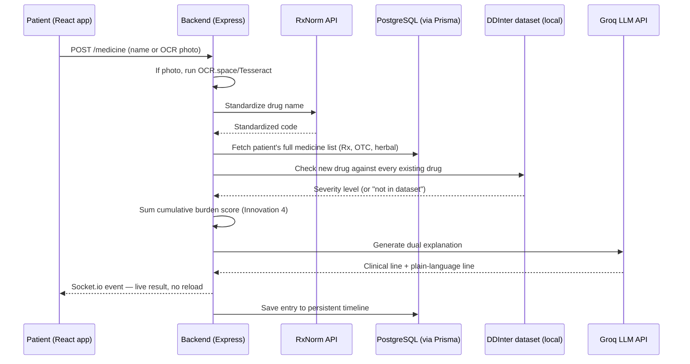

# PolySafe — Master Project Reference
**IEEE WIE ILS 2026 National Hackathon | Track 2: HealthTech | Problem Statement #4 — The Polypharmacy Crisis**

*The single, complete reference — share this with your whole team.*

## Table of Contents
- [One-Page Summary](#one-page-summary)
- [The Problem & Real Insight](#the-problem--real-insight)
- [One-Line Pitch](#one-line-pitch)
- [Who It's For](#who-its-for)
- [Accounts, Roles & Connections](#accounts-roles--connections)
- [Full Page List](#full-page-list-13-pages)
- [Page Navigation Flow](#page-navigation-flow)
- [Communication Flow](#communication-flow)
- [Full Feature List](#full-feature-list)
- [Permission Matrix](#permission-matrix--who-sees-what)
- [Why We're Different](#why-were-different-from-existing-tools)
- [Tech Stack](#tech-stack)
- [Free APIs & Data Sources](#free-apis--data-sources-checked-working)
- [Database Shape](#database-shape-conceptual)
- [Safety Rules](#safety-rules)
- [Data Privacy & Retention](#data-privacy--retention)
- [Demo Reliability](#demo-reliability--fallback-behavior)
- [Error Handling & Edge Cases](#error-handling--edge-cases)
- [Real Data Behind This](#real-data-behind-this)
- [Anticipated Tough Questions](#anticipated-tough-questions)
- [Appendix — Additional Clinical Depth](#appendix--additional-clinical-depth)
- [Real-World Impact Story](#real-world-impact--one-concrete-story)
- [Team Roles](#team-roles)
- [The Guardrail](#the-guardrail)

---

## One-Page Summary

| | |
|---|---|
| **Problem** | Interaction checkers exist, but nobody watches a patient's *whole* medication picture over time |
| **Core insight** | Harm doesn't come from one bad prescription — it comes from what nobody's watching together: prescriptions from different doctors, old drugs causing new symptoms, "not real medicine" like herbs/OTC that nobody mentions, and combined sedative load that looks safe drug-by-drug but isn't |
| **Four core innovations, one engine** | 1) Cross-Doctor Tracking 2) Symptom Origin Checker (prescribing cascade) 3) Herbal/OTC Blind-Spot Check 4) Cumulative Burden Index |
| **Real datasets** | DDInter (240,000+ interactions) · a published prescribing-cascade reference list · a herb-drug interaction list · a per-drug burden score table |
| **Real evidence** | 45% of adults 65+ live with polypharmacy · readmission risk climbs ~10%→38% with polypharmacy severity · doctors correctly identify a drug-caused symptom under 5% of the time in documented cascade cases |
| **Access model** | Consent-based only — nobody sees patient data without an approved connection, revocable anytime |

---

## The Problem & Real Insight

**Given problem statement:** "Build an AI system that detects harmful drug interactions from multiple prescriptions and explains risks in simple language to doctors and patients."

The problem statement already says "explain risks in simple language" — that's a baseline expectation, not the innovation. The real answer to *why this keeps happening* is four separate, documented gaps:

1. **Fragmented care** — a cardiologist prescribes drug A, a GP prescribes drug B two months later, neither sees the other's list
2. **Prescribing cascades** — a drug's side effect gets mistaken for a new illness, and a second drug gets added to treat it
3. **The "not real medicine" blind spot** — herbal remedies, Ayurvedic products, and OTC drugs are almost never mentioned to a doctor
4. **The pairwise blind spot** — standard checkers only compare drugs two at a time; several "harmless" drugs can combine into real sedative/confusion risk while every pairwise check still shows "safe"

One system, one persistent timeline, watching all four.

## One-Line Pitch
> "Nobody is watching a patient's full medication picture — across different doctors, across old drugs causing new symptoms, across the herbs and OTC drugs nobody thinks to mention, and across the combined load of drugs that each look harmless alone. We built one system that catches all four, and explains every risk twice: clinically for the doctor, plainly for the patient."

## Who It's For
- **Primary:** Patients and caregivers managing multiple medicines (especially elderly, 4+ meds)
- **Secondary:** Doctors reviewing patient history, pharmacists at the counter

---

## Accounts, Roles & Connections

**The core rule: nobody sees a patient's data by default.** Connection is always consent-based, initiated and approved by the patient. This is a real, defensible answer if judges ask "who can see my medical data."

### Account Types (4 roles)
| Role | Who | Can do |
|---|---|---|
| **Patient** | Manages their own medicines | Full read/write on own data. Approves/revokes all connections. |
| **Caregiver** | Family member helping an elderly patient | Read-only risk status + reminders. Cannot see full risk detail unless the patient explicitly grants it. |
| **Doctor** | Prescribing physician | Read-only view of a linked patient's timeline + clinical-mode explanations. Cannot edit the patient's medicine list — keeps a clean liability boundary. |
| **Pharmacist** *(extended)* | Dispensing counter | Read-only point-of-purchase check only, no persistent history access |

### Signup & Login
- **Patient/Caregiver:** phone number + OTP (simpler than email for elderly users, matches how most Indian health apps already work)
- **Doctor:** email + password, plus a professional registration-number field — structured for future verification, honestly not deeply verified at hackathon scope

### How Connection Works
**Patient ↔ Doctor:** patient generates a one-time Share Code/QR (expires in ~24h) from Doctor Share View → doctor enters it in their dashboard → patient gets an approval prompt → only after approval does the doctor see anything.

**Patient ↔ Caregiver:** patient adds caregiver directly by phone number from Settings → caregiver gets an invite → accepts → read-only access from then on.

**Revocation:** patient can cut off any doctor's or caregiver's access anytime from a "Connected People" screen — cheap to build (deactivates one database row), and a genuine trust signal worth mentioning explicitly to judges.

### Connection & Login Flow


### Permission Matrix — Who Sees What
| Data | Patient | Caregiver | Doctor (linked) |
|---|---|---|---|
| Full medicine list | Read/Write | ❌ | Read-only |
| Risk snapshot (green/yellow/red) | ✅ | ✅ | ✅ |
| Full risk explanation detail | ✅ | Status only | ✅ Clinical-mode |
| Medication timeline | ✅ | ❌ | Read-only |
| Symptom logs | Read/Write | ❌ | Read-only |
| Add/edit medicine | ✅ | ❌ | ❌ (doctor prescribes IRL, patient logs it) |
| Reminders | ✅ | ✅ (visibility to help remind) | ❌ |
| Revoke access | ✅ | ❌ | ❌ |

**Why doctors can't edit directly:** if a doctor could edit medicine data in-app, a bug or miscommunication becomes a direct liability problem ("the app changed my prescription") rather than a flagged risk to discuss. Read-only for doctors mirrors real life — they prescribe on paper/EMR, the patient brings it into the app.

---

## Full Page List (13 pages)

**Core pages:**
1. **Onboarding** — age, existing conditions (diabetes, kidney/liver), allergies. Skippable fields marked optional so patients aren't blocked by incomplete info.
2. **Home / Risk Snapshot** — green/yellow/red status, recent flags, today's reminders. **Empty state:** a first-time patient with no medicines yet sees a simple "Add your first medicine to get started" prompt instead of a blank screen.
3. **Add Medicine** — unified entry for prescriptions, OTC, herbal/Ayurvedic (manual or OCR scan)
4. **Risk Explanation Detail** — dual-mode explanation + Cumulative Burden Score
5. **Log Symptom** — patient logs a new symptom with a rough date
6. **Symptom Result** — matches against known cascade side effects
7. **Medication Timeline** — persistent, cross-doctor record

**Extended pages:**
8. Family / Caregiver View
9. Doctor Share View & Dashboard
10. Pharmacy Counter / Point-of-Purchase Check
11. Insights / Trends
12. Clinic / Hospital Analytics
13. Multilingual Settings (Hindi/Gujarati via LibreTranslate)

---

## Page Navigation Flow

Everything loops back to **Home** as the hub. Extended pages branch off but never block the core loop.

---

## Communication Flow

**Add Medicine (core pipeline — covers Innovations 1, 3, 4):**


**Log Symptom (Innovation 2):**
```
Patient logs symptom + date → Backend checks against cascade-pairs list
→ Cross-references patient's medicine start dates from Timeline
→ Match found → "possible cause" + drug + date started
→ Saved to timeline, linked to the flagged entry
```

**Data storage — what lives where:**
| Data | Stored in |
|---|---|
| Patient/doctor/caregiver profiles, connections | PostgreSQL (via Prisma) |
| Medicine list, symptoms, timeline | PostgreSQL (via Prisma) |
| Drug-drug interaction reference | DDInter dataset, local |
| Cumulative burden scores | Local lookup table |
| Prescribing-cascade reference | Local dataset |
| Herb-drug interaction reference | Local dataset |
| Live "checking..." status | Socket.io (not persisted) |
| Share codes | PostgreSQL, with expiry timestamp |

---

## Full Feature List

**Core:**
1. Add Medicine — unified Rx/OTC/herbal entry (manual + OCR)
2. Real-time interaction check
3. Dual-mode risk explanation
4. Cross-doctor tracking (Innovation 1)
5. Symptom Origin Checker (Innovation 2)
6. Cumulative Burden Index (Innovation 4)
7. Risk snapshot dashboard
8. Transparent confidence — flags missing data instead of assuming safe
9. Consent-based connection system (patient-controlled, revocable)

**Extended:**
10. Family/caregiver view
11. Doctor share view & dashboard
12. Pharmacy point-of-purchase check
13. Multilingual explanations
14. Hospital/clinic analytics
15. E-pharmacy integration
16. Proactive high-risk alerts
17. Voice input for elderly users

---

## Why We're Different From Existing Tools

| | Medscape / Epocrates | 1mg Interaction Checker | **PolySafe** |
|---|---|---|---|
| **Audience** | Clinicians only | General public, one-off | Both — dual explanation |
| **Memory** | None | None | Persistent, updates over time |
| **Cross-doctor tracking** | No | No | Yes |
| **Symptom-to-drug reasoning** | No | No | Yes |
| **Herbal/OTC coverage** | No | No | Yes |
| **Combined-drug sedative load** | No | No | Yes — Cumulative Burden Index |
| **Consent-based access model** | N/A | N/A | Yes — patient controls every connection |
| **Handles missing data** | Not transparent | Not transparent | Explicitly flagged |

---

## Tech Stack
- **Frontend:** React, deployed free on Vercel
- **Frontend data layer:** TanStack Query (React Query) — clean API fetching/caching, pairs naturally with Socket.io live updates
- **Backend:** Node.js/Express, PostgreSQL, deployed free on Render (supports persistent Socket.io connections)
- **ORM:** Prisma
- **Validation:** Zod
- **File uploads:** Multer
- **Real-time:** Socket.io
- **Auth:** JWT with role embedded in payload; every endpoint checks role + active connection before returning patient data
- **Phone OTP (patient/caregiver login):** Firebase Authentication, free tier — closes the gap between "phone + OTP signup" as described and an actual working implementation
- **Password hashing (doctor login):** bcrypt — doctors sign up with email + password; this is a baseline security expectation, not optional
- **QR/Share Code generation:** `qrcode` npm package — generates the doctor-connection QR/code described in the Accounts & Connections flow
- **Rate limiting:** express-rate-limit — one middleware line, but a real, defensible answer if asked what stops OTP/API abuse

## Free APIs & Data Sources (checked, working)
| Purpose | Tool |
|---|---|
| Drug-drug interactions | DDInter — free, downloadable, 240,000+ pairs |
| Drug name standardization | RxNorm API (NIH) — free, no key, 20 req/sec |
| Prescription photo OCR | OCR.space (free tier, 25,000 req/month), Tesseract as backup |
| Explanation generation | Groq API — free-tier LLM inference |
| Multilingual (extended) | LibreTranslate |
| Reminders (extended) | Firebase Cloud Messaging or OneSignal |

**Note:** NIH's old live drug-interaction API was discontinued Jan 2024 — don't cite it. RxNorm (standardization) is active; DDInter (downloaded dataset) is the actual interaction source.

## Database Shape (conceptual)
```
User (id, phone/email, role: patient | caregiver | doctor | pharmacist)
Patient (userId, age, conditions, allergies)
Medicine (id, patientId, name, type: rx|otc|herbal, addedBy, dateAdded)
Symptom (id, patientId, description, dateLogged)
Connection (patientId, connectedUserId, role: caregiver|doctor, status: pending|approved|revoked, expiresAt)
```
One `Connection` table handles both caregiver and doctor links via a `role` field — simpler than separate tables per relationship type, and easy to explain in one sentence to a judge.

---

## Safety Rules
- Persistent disclaimer: informational only, not a substitute for professional medical advice
- Never silently hide risk when data is missing — flag it explicitly
- When uncertain, err toward showing a warning, not suppressing one
- Caregiver view shows risk status only, not full medical detail
- The Cumulative Burden Index is framed as "worth discussing with your doctor" — never a standalone diagnosis
- Doctors are read-only on medicine data — they never edit it directly through the app

## Data Privacy & Retention
- Patient data is only visible to connections the patient has explicitly approved — no default sharing
- Patients can revoke any connection instantly from Settings
- Patients can delete their account and associated data on request — worth having this as a real, stated option rather than avoiding the question if asked
- Sensitive fields (conditions, allergies) stored in the database, not sent to third parties beyond what's needed for a single explanation-generation API call
- This is informational-app-level privacy handling, not a claim of formal medical-grade compliance (e.g., not claiming HIPAA/DPDP certification) — be upfront about that distinction if asked, rather than overstating compliance you haven't built

## Demo Reliability — Fallback Behavior
Live demos fail when a live API call fails at the wrong moment — worth planning for this explicitly rather than hoping it doesn't happen:
- Keep a **Demo Mode** toggle that uses pre-loaded sample responses instead of live OCR/Groq calls, so a flaky network at Grand Finale doesn't break the presentation
- Show real API calls when they work, but have the fallback ready — this is a practical, honest engineering decision, not a claim that the system doesn't really work live

## Error Handling & Edge Cases
- **OCR can't read the photo:** fall back to manual entry, don't block the user
- **RxNorm/DDInter has no match for a drug name:** explicitly show "not enough data to check this" — never silently assume safe
- **Duplicate medicine entry:** detect and prompt "already in your list — update dosage instead?" rather than creating a duplicate silently
- **Groq API times out:** show the raw severity level from the dataset lookup immediately, with the plain-language explanation following once ready — never block the whole result on the slowest step

---

## Real Data Behind This
- ~45% of adults 65+ experience polypharmacy
- Adverse drug reactions cause 5–6% of acute hospitalizations, roughly doubling in older polypharmacy patients
- ~20% of hospital readmissions are medication-related, ~70% of those possibly preventable
- 30-day readmission risk rises from ~10% (no polypharmacy) to ~38% (excessive polypharmacy)
- In documented prescribing-cascade cases, doctors correctly identified the true drug cause under 5% of the time

## Anticipated Tough Questions
**"Where's your interaction data from?"** → DDInter, publicly downloadable, severity-classified. Gaps shown explicitly, never hidden.
**"What if the AI is wrong?"** → It only translates a dataset-backed severity level into plain language — never invents a new medical claim. Disclaimer always shown.
**"How is this different from 1mg?"** → Persistent, cross-doctor, catches symptom-cause links, covers herbal/OTC, catches combined sedative load — none of which existing tools do.
**"Can you build this in time?"** → Yes — one core pipeline reused across drug-drug, drug-symptom, herb-drug, and cumulative-burden checks. No custom model training.
**"Who can see my data, and how do you control that?"** → Nobody by default. Every doctor/caregiver connection is patient-approved via a Share Code, and revocable anytime from Settings.
**"What happens if a live demo API fails?"** → We have a Demo Mode fallback with pre-loaded responses specifically for this — a real engineering decision, not a hidden weakness.

---

## Appendix — Additional Clinical Depth
*(Real, clinically grounded, kept as Q&A depth — not core build scope.)*

**Chronotherapy/Absorption Timing:** some drugs physically block each other's absorption if taken at the same time (e.g., thyroid medication + calcium/iron). A future version could suggest spacing rather than just flagging danger. Genuinely useful, real scheduling-logic build — out of scope now.

**Long-Duration Prescription Review (passive only):** a future version could flag long-duration prescriptions on a recognized high-risk list for the doctor's own review — never framed as a recommendation to stop or change medication, since that's a materially bigger claim than surfacing a risk.

---

## Real-World Impact — One Concrete Story
*(A realistic scenario, not a real patient.)*

Meet **Mrs. Sharma, 68**, on 5 medications across two doctors who've never seen each other's prescriptions.

1. **Cross-doctor tracking:** her family physician's new prescription is checked against her *entire* list, including the cardiologist's — catching a flag neither doctor would see alone.
2. **Symptom Origin Checker:** her leg swelling matches a known side effect of a drug started six weeks ago — caught before a new drug gets added to treat a symptom that was never a new illness.
3. **Herbal/OTC blind spot:** her daily turmeric supplement, never mentioned to either doctor, gets checked the same way as her prescriptions — catching a real interaction with her blood pressure drug.
4. **Cumulative Burden Index:** none of her drugs flag individually, but three together cross a critical combined sedative threshold — the kind of pattern often mistaken for early dementia.
5. **Consent-based access:** her son, added as a caregiver, sees her risk status and can help remind her — without seeing her full medical detail, because that's what she chose to share.

**Why this matters:** one patient, one week, five moments where the same underlying gap — nobody watching the whole picture, and nobody controlling who sees it — could go wrong, all caught by one system built around a single, consent-protected timeline.

---

## Team Roles

| Role | Responsibility | Core skills |
|---|---|---|
| **Frontend Developer** | Builds the 7 core pages + role-based UI (patient/caregiver/doctor views) in React; Socket.io integration | React, state management, Socket.io client |
| **Backend Developer** | Express API, Prisma schema, interaction/cascade/herb/burden logic, connection & auth system | Node.js/Express, Prisma, PostgreSQL |
| **AI/Data Lead** | Loads DDInter/cascade/herb/burden datasets, Groq prompt templates, owns data accuracy for Q&A | Data handling, prompt design |
| **OCR/Integration Lead** | OCR.space/Tesseract wiring, Multer uploads, Demo Mode fallback logic | API integration, file handling |
| **Design/Presentation Lead** | UI/UX, document formatting, pitch deck, live demo script | UI design, technical writing, presentation |

**Smaller team:** merge Backend + AI/Data, merge OCR/Integration into Frontend.

**What each person must be able to explain cold:** Frontend/Design → all four innovations + the consent model, in plain words. Backend/AI → exactly how each lookup works and where each dataset comes from. Presenter → the real statistics, dataset names, and the "so what," without notes.

---

## The Guardrail
- Don't just repeat the problem statement — lead with the fragmentation/cascade/blind-spot/burden insight
- Don't oversell — every claim above is sourced or clearly labeled as extended/future scope
- Keep the core 7 pages, 4 innovations, and consent-based access model fully working and fully explainable — everything else stays clearly separate
